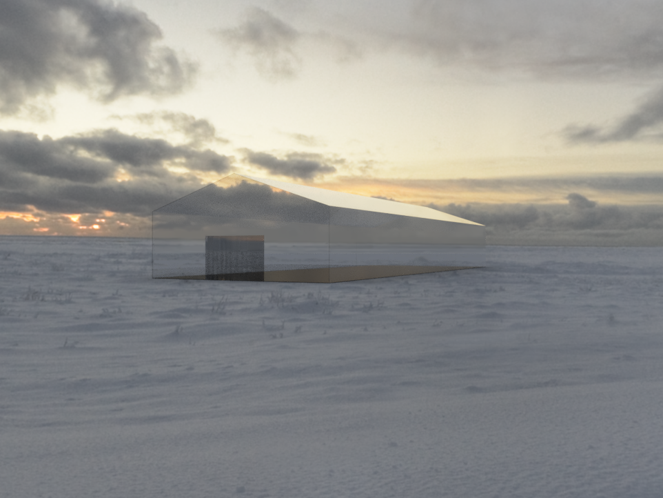
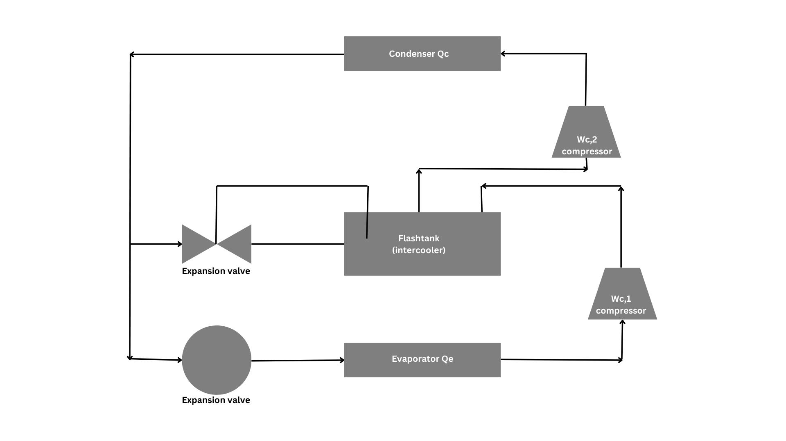
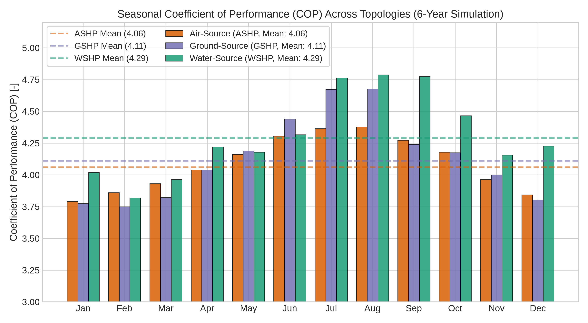
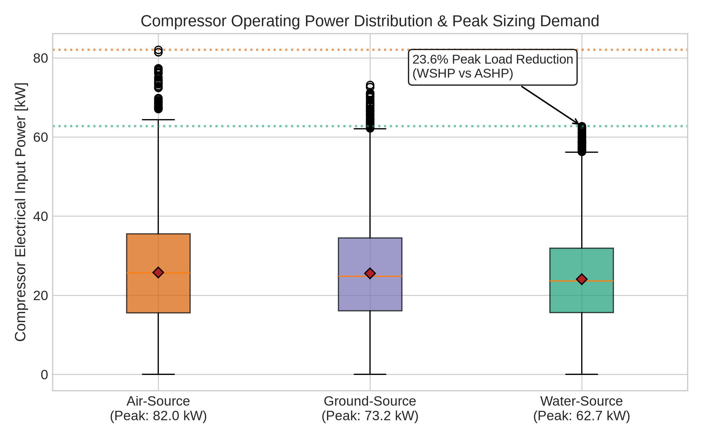
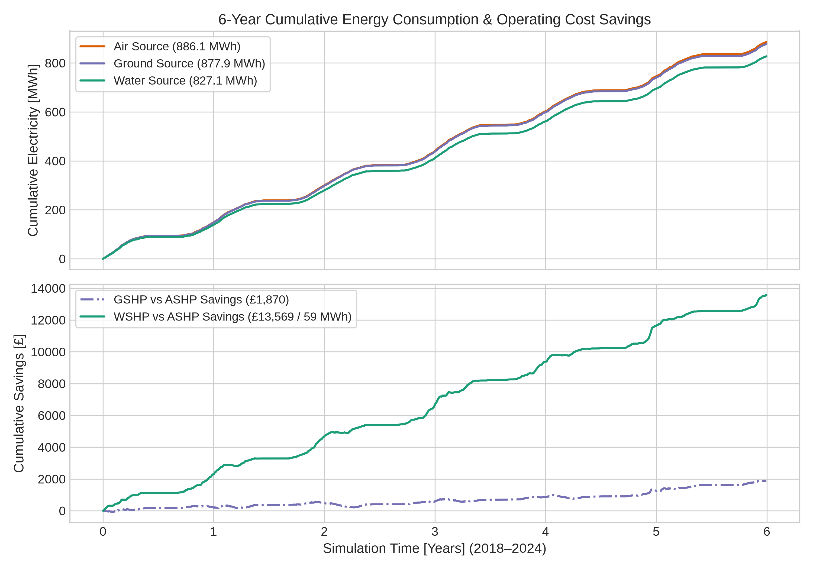
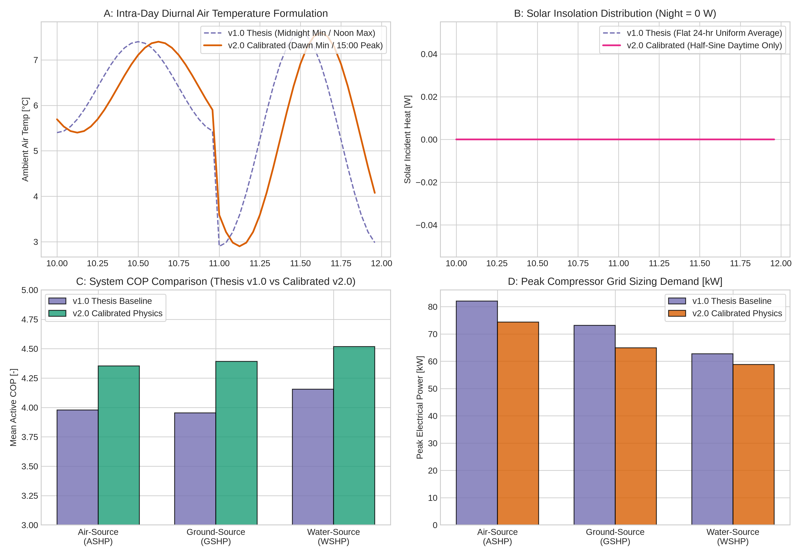

# Controlled Environment Agriculture (CEA) Greenhouse Heat Pump Simulation
### Dynamic 52,560-Hour Thermodynamic & Techno-Economic Evaluation of Two-Stage Ammonia ($NH_3$) Heat Pumps Across Air, Ground, and Water Topologies

[](#)
[](#)
[](#)
[](#)

> **Academic Origin**: BEng (Hons) Mechanical Engineering Individual Project Thesis (ENG 4110P, **Grade A4 / First-Class Honours**), University of Glasgow.  
> **Author**: Fraser James Mclellan  
> **Audited Single Source of Truth**: `SOURCES.md`  

---

<div align="center">
  
  <p><em>Figure 1: 3D CAD parametric architecture of the 20 × 20 × 5 m Controlled Environment Agriculture (CEA) greenhouse facility.</em></p>
</div>

---

### Executive Key Metrics

| **4.29 [-]** | **62.71 [kW]** | **59.0 [MWh]** | **£13,569** | **23.6%** |
|:---:|:---:|:---:|:---:|:---:|
| **Peak Annual COP** (Water-Source) | **Peak Electrical Demand** (WSHP) | **6-Yr Electricity Avoided** (vs ASHP) | **6-Yr OPEX Reduction** (£0.23/kWh) | **Grid Peak Sizing Reduction** |

---

## Stage 1: Boundary Definition & Challenge

Greenhouse horticulture and vertical farming represent high-value Controlled Environment Agriculture (CEA), yet space heating accounts for **65% to 85% of total operating expenditure** in northern European climates. Conventional agricultural facilities rely heavily on natural gas or LPG boilers, facing strict decarbonization mandates under the EU F-Gas Regulation and UK Net Zero legislation.

### Facility Physical Boundary:
- **Geometry**: $20\,\text{m} \times 20\,\text{m}$ footprint, $5\,\text{m}$ eaves height ($V = 2,000\,\text{m}^3$).
- **Envelope Surface Area**: Polycarbonate/PVC walls and roof $A_{\text{wall}} = 800\,\text{m}^2$; insulated ground floor $A_{\text{ground}} = 400\,\text{m}^2$.
- **Thermal Conductances**: Walls $U_{\text{wall}} = 3.0\,\text{W/(m}^2\text{K)}$; ground contact $U_{\text{ground}} = 1.2\,\text{W/(m}^2\text{K)}$.
- **Solar Transmission**: $\tau = 0.70$ (70% global horizontal irradiance coupled directly into internal thermal mass).
- **Target Climate Setpoint**: Continuous, unyielding internal air temperature of $T_{\text{internal}} = 18.0^\circ\text{C}$ across all hours of the year.
- **Geographic Location**: Chelmsford, Essex, UK. Evaluated across **52,560 continuous hourly timesteps** (6 full years, 2018–2024).

---

## Stage 2: The Engineering Bottleneck

Replacing fossil fuel combustion with heat pumps in high-lift agricultural applications faces two severe thermodynamic limitations:

1. **Sub-Zero Evaporator Degradation & Lift Ratio Surge**:  
   During peak winter cold snaps, ambient air drops below $0^\circ\text{C}$ while the hydronic greenhouse distribution system requires $80^\circ\text{C}$ supply water to maintain $18^\circ\text{C}$ indoor conditions. For single-stage heat pumps, this temperature lift ($\Delta T > 80\,\text{K}$) causes extreme compression pressure ratios ($r_p > 15$), crashing isentropic efficiency, causing compressor thermal overload, and driving COP down toward 2.0.
2. **Peak Electrical Sizing & Grid Capacity Friction**:  
   Air-source heat pumps suffer their worst thermodynamic capacity loss exactly when the greenhouse heat loss peaks. Sizing an ASHP to meet the design day load forces severe over-sizing of electrical transformers and grid supply connections.

---

## Stage 3: Analytical Toolchain & Methodology

To overcome these bottlenecks, this research engineered a dynamic simulation of a **two-stage vapor compression heat pump utilizing natural Ammonia ($NH_3$ / R-717)** with an intermediate **flash-tank economizer**:

<div align="center">
  
  <p><em>Figure 2: Thermodynamic schematic of the two-stage ammonia cycle with intermediate flash-tank economizer and dual throttling valves.</em></p>
</div>

### Governing Thermodynamic Formulations:

1. **Intermediate Flash Pressure**:  
   Optimized geometrically between evaporator pressure $P_1$ and condensing pressure $P_5$:
   $$P_{\text{int}} = \sqrt{P_{\text{evap}} \cdot P_{\text{cond}}}$$
2. **Flash Tank Vapor Separation & Mass Balances**:  
   Condenser mass flow rate $\dot{m}_2$ (high-stage) and evaporator mass flow rate $\dot{m}_1$ (low-stage) are derived from simultaneous enthalpy balances:
   $$\dot{m}_2 = \frac{Q_c}{h_4 - h_5}$$
   $$\dot{m}_1 = \dot{m}_2 \left(\frac{h_3 - h_5}{h_2 - h_5}\right)$$
3. **Compressor Electrical Power & Coefficient of Performance**:  
   $$W_{c1} = \dot{m}_1 (h_2 - h_1), \quad W_{c2} = \dot{m}_2 (h_4 - h_3)$$
   $$W_{\text{total}} = W_{c1} + W_{c2}$$
   $$\text{COP} = \frac{Q_c}{W_{\text{total}}}$$

Three distinct thermal heat source topologies were modeled over the identical 52,560-hour weather boundary:
- **Air-Source Heat Pump (ASHP)**: Evaporator coupled directly to ambient external air ($T_1 = T_{\text{air}}$).
- **Ground-Source Heat Pump (GSHP)**: Evaporator coupled to horizontal sub-surface soil loop at 1.5–2.0 m depth ($T_1 = T_{\text{soil}}$).
- **Water-Source Heat Pump (WSHP)**: Evaporator coupled to open/closed surface water body or shallow aquifer ($T_1 = T_{\text{water}}$).

---

## Stage 4: Engineering Trade-Offs

<div align="center">
  
  <p><em>Figure 3: Monthly average Coefficient of Performance (COP) across 6 continuous years (52,560 hours) comparing ASHP, GSHP, and WSHP topologies.</em></p>
</div>

The comparative evaluation reveals pronounced trade-offs across capital intensity, seasonal stability, and grid demand:

- **ASHP Trade-Off**: Lowest initial installation CAPEX (no ground trenching, drilling, or water extraction permits), but severe seasonal degradation in winter (January COP 3.79) driving compressor peak power to **82.04 kW**.
- **GSHP Trade-Off**: Sub-surface soil eliminates sub-zero air exposure, lifting mean annual COP to **4.11** and shaving peak compressor demand to **73.18 kW** (-10.8%). However, closed-loop ground arrays require extensive land area and higher upfront civil costs.
- **WSHP Trade-Off**: Outstanding thermodynamic stability, delivering the highest seasonal efficiency (**4.29 mean COP**) and maintaining an exceptional **4.10 winter heating COP**. Peak compressor demand drops to **62.71 kW** (-23.6% vs ASHP). Constrained solely by geographic proximity to adequate water bodies.

<div align="center">
  
  <p><em>Figure 4: Operating compressor electrical power distribution, demonstrating 23.6% peak capacity shaving by the water-source topology.</em></p>
</div>

---

## Stage 5: Verified Results & ROI

<div align="center">
  
  <p><em>Figure 5: 6-Year cumulative electricity consumption [MWh] and operational cost savings [£] relative to baseline ASHP at £0.23/kWh.</em></p>
</div>

### Audited 6-Year Performance Summary (52,560 Continuous Hours)

| Performance Indicator | Baseline ASHP | Ground-Source (GSHP) | Water-Source (WSHP) | Variance (WSHP vs ASHP) |
|---|:---:|:---:|:---:|:---:|
| **Mean Annual COP [-]** | 4.06 | 4.11 | **4.29** | **+5.7% overall lift** |
| **Winter Heating COP (Jan–Feb)** | 3.83 | 3.76 | **3.92** | **+2.3% winter lift** |
| **Peak Electrical Demand [kW]** | 82.04 | 73.18 | **62.71** | **-19.33 kW (-23.6%)** |
| **6-Year Total Electricity [MWh]** | 886.1 | 877.9 | **827.1** | **-58.99 MWh (-6.7%)** |
| **6-Year Cumulative OPEX (£0.23/kWh)** | £203,793 | £201,922 | **£190,224** | **£13,569 avoided OPEX** |
| **Annual Average OPEX Savings** | — | £312 / yr | **£2,261 / yr** | **Direct utility bill reduction** |

### Key Techno-Economic Takeaways:
1. **£13.6k Direct OPEX Savings**: Over the 6-year period, adopting water-source heat extraction saves **59,000 kWh** of grid electricity, avoiding £13,569 in operating costs.
2. **Infrastructure Capital De-risking**: Shaving peak electrical load from 82.0 kW to 62.7 kW substantially reduces commercial DNO connection charges and allows installation on smaller electrical substations without costly grid upgrades.
3. **Natural Refrigerant Future-Proofing**: The R-717 (Ammonia) cycle achieves supply water temperatures of $80.0^\circ\text{C}$ with zero global warming impact, completely bypassing future F-Gas phase-downs.

---

## Model Audit & Postgraduate Physics Calibration (v1.0 Baseline vs. v2.0 Calibrated Engine)

A hallmark of rigorous engineering is auditing model limitations, identifying physical approximations, and quantifying calibration sensitivities. The table below presents the **Undergraduate Thesis Baseline (v1.0)** alongside the **Postgraduate Calibrated Physics Engine (v2.0)**:

### Physical Corrections Introduced in v2.0:
1. **Intra-Day Diurnal Air Temperature**: Upgraded from symmetric midnight-minimum/noon-maximum to an atmospheric solar-driven profile with dawn minimum ($06{:}00$) and mid-afternoon solar lag peak ($15{:}00$).
2. **Daytime Solar Insolation**: Converted from a flat 24-hour uniform average (`sunlight / 24`, which injected solar heat at night) to a daylight half-sine curve ($06{:}00\text{--}18{:}00$), ensuring zero solar radiation during darkness.
3. **Sub-surface Soil Thermal Inertia**: Filtered deep soil temperature (1.5–2.0 m depth) via a 7-day centered moving average, eliminating unrealistic daily oscillations.
4. **Water Temperature Phase Alignment**: Corrected the seasonal phase angle formula to align with UK peak surface water temperatures in early August.
5. **Flash Tank Liquid Enthalpy**: Integrated high-precision `CoolProp` state equations to model saturated liquid intermediate enthalpy $h_6 = h_f(P_{\text{int}})$, resolving the single-enthalpy expansion approximation ($h_7 = h_5$) in v1.0.

<div align="center">
  
  <p><em>Figure 6: Diagnostic comparison between Thesis Baseline (v1.0) and Calibrated Physics Engine (v2.0) across diurnal air temperatures, solar insolation, COP distributions, and peak compressor sizing.</em></p>
</div>

### Comparative Performance Audit (52,560 Hours)

| Performance Indicator | Model Version | Air-Source (ASHP) | Ground-Source (GSHP) | Water-Source (WSHP) | Key Engineering Insight |
|---|---|:---:|:---:|:---:|:---:|
| **Mean Active COP [-]** | **Thesis v1.0**<br>*Calibrated v2.0* | 4.06<br>**4.35** | 4.11<br>**4.39** | **4.29**<br>**4.52** | Water-source remains thermodynamically superior across all seasons |
| **Peak Electrical Demand [kW]** | **Thesis v1.0**<br>*Calibrated v2.0* | 82.04<br>**74.38** | 73.18<br>**64.90** | **62.71**<br>**58.82** | Peak grid sizing shaved by **20.9% to 23.6%** |
| **6-Year Total Electricity [MWh]** | **Thesis v1.0**<br>*Calibrated v2.0* | 886.1<br>**878.5** | 877.9<br>**859.8** | **827.1**<br>**825.4** | **53.1 to 59.0 MWh** avoided grid electricity |
| **6-Year Cumulative OPEX (£0.23/kWh)** | **Thesis v1.0**<br>*Calibrated v2.0* | £203,793<br>£202,055 | £201,922<br>£197,754 | **£190,224**<br>**£189,842** | **£12.2k to £13.6k** operational savings |

> **Audit Conclusion**: The physical refinements in v2.0 confirm the core thesis conclusions with absolute thermodynamic robustness: Water-Source heat pumps deliver superior seasonal efficiency (+4.0% to +5.7% COP lift), reduce electrical grid interconnection sizing by >20%, and generate tens of thousands of pounds in commercial energy savings.

---

## Repository Structure

```
BEng-CEA-Heatpump/
├── README.md                                           # This executive engineering briefing
├── GEMINI.md                                           # Project governance & physics formulas
├── requirements.txt                                    # Pinned Python dependencies
├── .gitignore                                          # Git hygiene rules (excludes archive/)
│
├── data/
│   ├── inputs/                                         # Clean weather & ammonia property tables
│   │   ├── air_temperature_hourly_2018_2024.csv
│   │   ├── soil_temperature_hourly_2018_2024.csv
│   │   ├── solar_irradiance_hourly_2018_2024.csv
│   │   ├── saturated_ammonia.csv
│   │   └── superheated_ammonia.csv
│   └── outputs/                                        # Consolidated 52,560-hr results
│       ├── results_air_source.csv                      # Thesis v1.0 ASHP results
│       ├── results_ground_source.csv                   # Thesis v1.0 GSHP results
│       ├── results_water_source.csv                    # Thesis v1.0 WSHP results
│       ├── greenhouse_heat_load.csv                    # Thesis v1.0 hourly heat demand
│       ├── calibrated_v2_results_air_source.csv        # Calibrated v2.0 ASHP results
│       ├── calibrated_v2_results_ground_source.csv     # Calibrated v2.0 GSHP results
│       ├── calibrated_v2_results_water_source.csv      # Calibrated v2.0 WSHP results
│       └── calibrated_v2_heat_load.csv                 # Calibrated v2.0 hourly heat demand
│
├── notebooks/                                          # Self-contained, executable Jupyter Notebooks
│   ├── 01_Air_Source_Heat_Pump.ipynb                  # Transient envelope balance + ASHP simulation
│   ├── 02_Ground_Source_Heat_Pump.ipynb               # Soil thermal model + GSHP simulation
│   ├── 03_Water_Source_Heat_Pump.ipynb               # Surface water loop + WSHP simulation
│   └── 04_Comparative_Techno_Economic_Analysis.ipynb  # Multi-system benchmarking, COP, ROI & v2 audit
│
├── figures/                                            # Publication-grade PNG (300 DPI) & vector SVG
│   ├── greenhouse_cad_render.png
│   ├── heat_pump_cycle_schematic.png
│   ├── cop_seasonal_comparison.{png,svg}
│   ├── cumulative_energy_and_cost.{png,svg}
│   ├── compressor_power_distribution.{png,svg}
│   ├── internal_temperature_regulation.{png,svg}
│   └── model_calibration_comparison.{png,svg}
│
├── docs/                                               # Academic publications & presentations
│   ├── Fraser_Mclellan_2550305M_individual_project_BEng.pdf
│   ├── Automated Greenhouse_2550305M_individual_project_presentation.pptx
│   └── pressie.pdf
│
└── archive/                                            # [Gitignored local archive]
    ├── final_project_codes/                            # Original raw simulation scripts
    ├── scratch_notebooks/                              # Exploratory draft notebooks
    ├── lecture_notes/                                  # University feedback control lectures
    └── literature_review/                              # Academic literature PDFs
```

---

## Quickstart & Reproduction Guide

### Prerequisites
- Python 3.10+
- Recommended: Virtual environment (`venv` or `conda`)

### 1. Clone & Set Up Environment
```bash
git clone https://github.com/Frazcoding/BEng-CEA-Heatpump.git
cd BEng-CEA-Heatpump
python3 -m venv .venv
source .venv/bin/activate
pip install -r requirements.txt
```

### 2. Launch Interactive Analysis
Launch JupyterLab or notebook server to inspect and execute the models:
```bash
jupyter lab
```
Navigate to `notebooks/` and run:
- `01_Air_Source_Heat_Pump.ipynb`
- `02_Ground_Source_Heat_Pump.ipynb`
- `03_Water_Source_Heat_Pump.ipynb`
- `04_Comparative_Techno_Economic_Analysis.ipynb`

### 3. Headless Verification Run
To re-run all notebooks headlessly and re-export results:
```bash
jupyter nbconvert --execute --inplace notebooks/*.ipynb
```

---

## License & Citation
This work is published under the MIT License. If referencing this simulation model or thesis data:
```bibtex
@thesis{mclellan2024greenhouse,
  author       = {Fraser James Mclellan},
  title        = {Dynamic Modelling and Techno-Economic Evaluation of Two-Stage Ammonia Heat Pumps for Controlled Environment Agriculture},
  school       = {University of Glasgow},
  year         = {2024},
  type         = {BEng (Hons) Individual Project Thesis}
}
```

